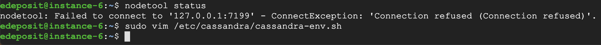

# Mama Cass, The Solo Tour  --  Group Notes

### Starting a new VM instance
- For machine, select: `g1-small (1 vCPU, 1.7 GB memory)`
- For Boot disk, select `Ubuntu 18.04 LTS`


### Installing
- Add the Apache repository of Cassandra
```
echo "deb http://www.apache.org/dist/cassandra/debian 36x main" | sudo tee -a /etc/apt/sources.list.d/cassandra.sources.list
```

- Add the Apache Cassandra repository keys:
```
curl https://www.apache.org/dist/cassandra/KEYS | sudo apt-key add -
```

- Update the repositories:
```
sudo apt-get update
```

- Then add the public key A278B781FE4B2BDA as follows:
```
sudo apt-key adv --keyserver pool.sks-keyservers.net --recv-key A278B781FE4B2BDA
```

- Install Cassandra:
```
sudo apt-get install cassandra
```
- install cassandra-driver due to a bug with cassadra and Ubuntu
```
pip install cassandra-driver
```

[installation instructions](http://cassandra.apache.org/doc/latest/getting_started/installing.html)

### Configure for LocalHost
This only needs to be done after a fresh install.  We will probably need to change this configuration later when we transition to clusters.  
```
sudo vim /etc/cassandra/cassandra-env.sh
```

- search for `JVM_OPTS=`
- Then Comment out the line:
```
#JVM_OPTS="$JVM_OPTS -Xloggc:/var/log/cassandra/gc.log"
```
- replace with:
```
JVM_OPTS="$JVM_OPTS -Djava.rmi.server.hostname=127.0.0.1:7199"
```
- restart Cassandra so the change takes affect 
``` 
systemctl restart cassandra
```
[configuring Cassandra Instructions](http://cassandra.apache.org/doc/latest/getting_started/configuring.html)   

[configuring for local host](https://www.liquidweb.com/kb/error-failed-to-connect-to-127-0-0-17199-connection-refused-cassandra-solved/)

### Bugs
Run the following command each time you start you ssh session or add it to your `.bashrc` file.
```
export CQLSH_NO_BUNDLED=true
```

[bug fix instructions](https://thelastpickle.com/blog/2016/08/16/cqlsh-broken-on-fresh-installs.html)

#### unable to connect to local host error
If you are unable to connect to the localhost, Makesure the port you or cqlsh are using matches the port specified in the configuration file: `/etc/cassandra/cassandra-env.sh`.  You may have to change the port in the configuration file to match the port that cqlsh is trying to connect on.  I'm not sure why it changes. 



Change configuration file to match port that cqlsh is using

`JVM_OPTS="$JVM_OPTS -Djava.rmi.server.hostname=127.0.0.1:<port number you are trying to use>"`

### How To Run
You can start Cassandra with `sudo service cassandra start` and stop it with `sudo service cassandra stop`. However, normally the service will start automatically. For this reason be sure to stop it if you need to make any configuration changes.  
- Verify that Cassandra is running by invoking `nodetool status` from the command line.
- To Connect to cluster using CQLSH: `cqlsh localhost`  

[Starting Cassandra Server](http://cassandra.apache.org/doc/latest/getting_started/installing.html)

[Starting CQLSH](http://cassandra.apache.org/doc/latest/getting_started/querying.html)

 

### Source files location on Google Cloud VM
/home/highway_data/

### cqlsh command for creating a keyspace
```
CREATE KEYSPACE IF NOT EXISTS testcass 
  WITH replication = {'class':'SimpleStrategy', 'replication_factor': 1};
```

### cqlsh command for creating a small table. the large table will need more options set
```
CREATE TABLE IF NOT EXISTS testcass.freeway_detectors(
  detectorid int PRIMARY KEY, 
  highwayid int, 
  milepost float, 
  locationtext text, 
  detectorclass int, 
  lanenumber int, 
  stationid int
  );
  ```

### cqlsh command for loading a csv file into an existing table - I, Chad, could not get this to work. Please let me know if you get it working.
```
COPY testcass.freeway_detectors(detectorid, highwayid, milepost, locationtext, detectorclass, lanenumber, stationid)
 FROM 'freeway_detectors.csv'
 WITH DELIMITER=','
 AND HEADER=TRUE;
```
